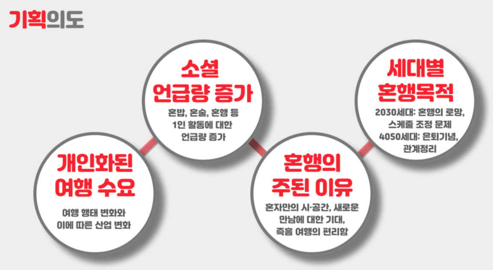
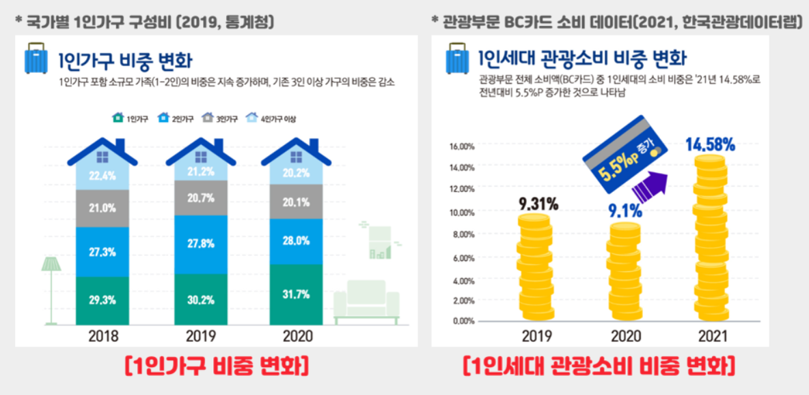
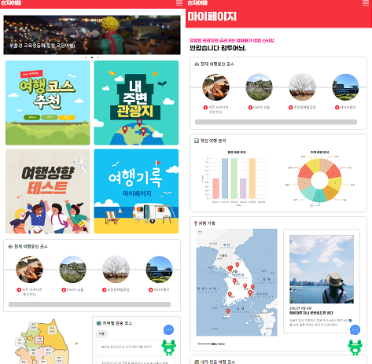
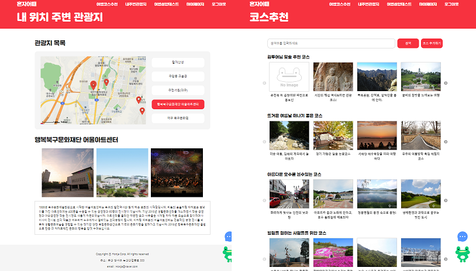
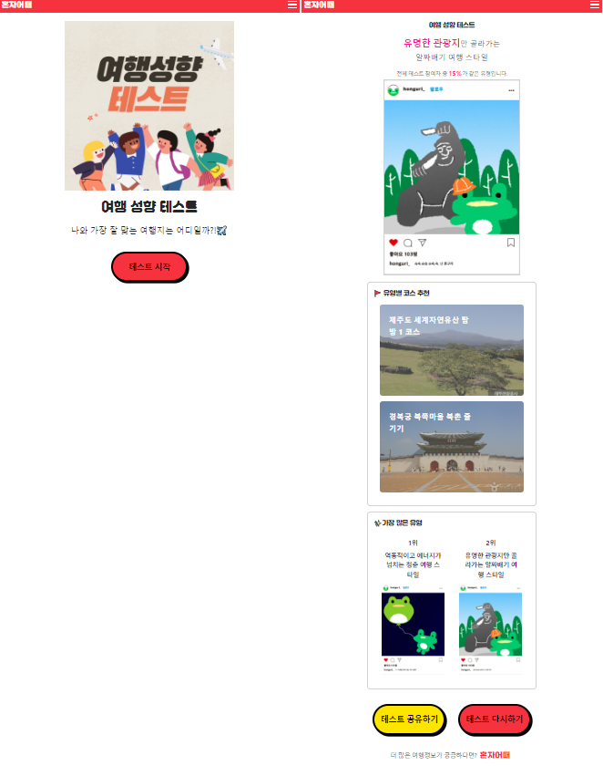
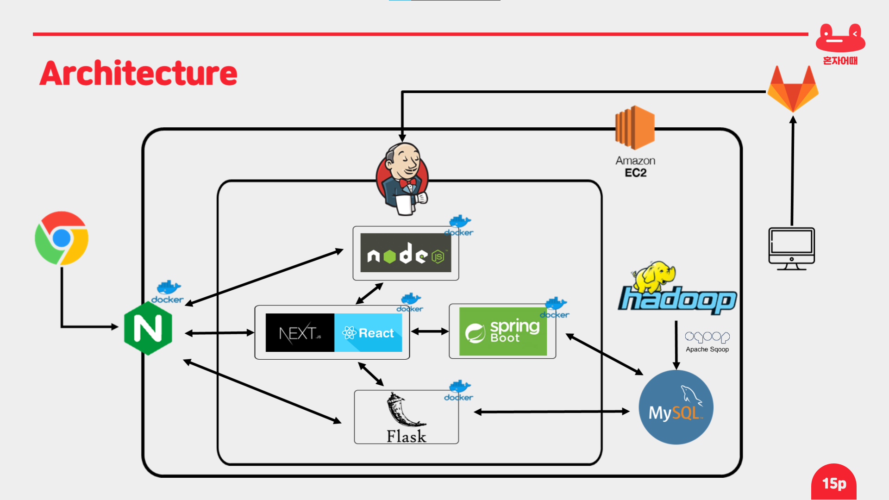

## **🔴 서비스 소개**

### **&#127758;주제**

혼행(혼자 여행)을 즐기는 사람들을 위한 맞춤형 플랫폼

 

### **🌔개요**

- 개발기간
- 팀원정보
- 서비스 기획
  - 기획의도
  - 관련 자료조사
- Frontend
  - UI
- Backend
  - DB 설계
  - 기술 아키텍처
- 주요 기능
  - 메인
  - 여행 코스 추천
  - 위치 기반 주변 관광지
  - 여행 성향 테스트
  - 코스 상세보기
  - 여행시작
  - 여행시작 - 채팅
  - 코스 추가
  - 마이페이지

 

### **🌞개발 기간**

**2022.03.02 ~ 2022.04.07**

 

### **🌟팀원정보**

|         👑 손은성         |      지수민       |          강소현          |      진은성       |      차상훈      |
| :-----------------------: | :---------------: | :----------------------: | :---------------: | :--------------: |
| 팀장 FrontEnd UI/UX | FrontEnd UI/UX | BackEnd 추천 알고리즘 | BackEnd Hadoop | BackEnd CI/CD |

  

## **🔴 서비스 기획**

### **기획의도**

- 코로나 이후 개인화된 여행 수요로 인해 여행행태의 변화 및 사업의 변화가 발생
- 여러 소셜에서 혼밥, 혼술, 혼행 등 1인 활동에 대한 언급량이 증가할 만큼 혼행의 관심도가 급증
- 혼행을 통해 혼자만의 시,공간, 즉흥여행의 편리함 등의 이유로 인해 혼행을 시작하는 인원 증가
- 혼자만의 여행을 준비하거나 시작하는 사람에게 도움이 되는 서비스를 제공하고자 혼자어때를 개발

### **관련 자료조사**

- 2019년 통계청에서 발표된 자료를 통해 1인가구 비중 변화에 따르면 타 가구는 감소하는 반면 1인 가구의 비중은 지속적으로 증가하는 것을 확인
- 2021년 한국관광데이터랩에서 발표된 자료를 통해 2020년~2021년 사이 기존 대비 약 60% 증가하는 것을 확인
- 한국 관광공사 관광빅데이터실의 소셜 및 미디어 데이터 분석 결과
  - 혼행의 장점
    - 즉흥 여행의 편리함
    - 새로운 만남 기회
    - 편리한 일정 조정과 의사결정
    - 동반 여행의 불편함 해소
  - 혼행의 단점
    - 불편한 혼밥
    - 높은 여행비용
    - 불편한 교통수단
    - 사진촬영, 여행계획 수립 어려움

 

### **🌐FrontEnd**

#### **UI**

메인 페이지 / 마이페이지

 

내 위치 주변 관광지 / 코스 추천

 

여행 성향 테스트

 

### **🌐Backend**

#### **DB 설계**

 

### **기술 아키텍처**

  

## **🔴 주요 기능**

### **메인페이지**

- 상단 배너를 통해 혼자 어때의 인기 코스를 나타낸다.

- 여행 코스 추천, 내 주변 관광지, 여행 성향 테스트, 여행 기록 마이페이지 메뉴를 클릭하여 각 페이지로 이동할 수 있다.

- 지도에 각 지역의 관광지 개수를 나타내며, 각 지역을 누르면 지역별 인기 코스 5개를 확인할 수 있다.

- 각 코스를 클릭할 시 바로 코스 상세보기로 연결이 되며 코스의 상세정보를 확인할 수 있다.

- 오른쪽 하단에 혼자어때의 마스코트인 혼구리(개구리) 를 클릭하면 혼자어때 설명서를 확인할 수 있다.

 

### **여행 코스 추천**

- 키워드별 여러 코스들을 추천받을 수 있다.

- 로그인 시, 사용자 맞춤 추천 코스 리스트를 확인할 수 있다.

- 비로그인 시, 혼자 어때 인기 코스를 추천받을 수 있다.

- 검색을 통해 찾고 싶은 코스를 검색할 수 있다.

 

### **위치 기반 주변 관광지**

- 현재 위치 기반으로 주변 2km 이내의 관광지를 최대 5개까지 확인할 수 있다. 각 관광지는 카카오 지도에 마커로 표시되어 있다.

- 각 관광지를 눌렀을 때 관광지의 이미지와 상세정보가 나타난다.

 

### **여행 성향 테스트**

- 6개의 문항을 통해 나의 성향을 확인하고 성향에 맞는 코스를 추천한다.

- 혼자 어때에 가장 많은 유형을 보여주며 테스트를 다시 진행하거나 카카오톡을 통해 공유할 수 있다.

- 혼자 어때를 클릭 시 홈페이지로 이동한다.

 

### **코스 상세보기**

- 코스 이름 아래에 여행시작 버튼과 좋아요 버튼이 있다.

  - 좋아요(하트아이콘)를 클릭하면 마이페이지에서 저장된 코스를 확인할 수 있다.

- 코스 설명과 관광지 정보를 볼 수 있다. 관광지는 방문 순서대로 나타내며 카카오 지도를 통해 마커 표시가 되어 있다.

- 코스에 대해서 새로운 인연을 만날 확률을 볼 수 있다.

  - 여행 중(60%) + 관광지 방문(35%) + 북마크(15%)

- 여행 성향 테스트 결과 유형 별로 해당 코스에 대한 여행 비율을 파악하기 쉽게 시각화했다.

- 해당 코스 여행을 한 사용자라면 여행 후기를 남길 수 있고 남긴 후기는 코스 상세보기를 통해서 사용자들이 작성한 코스 후기를 조회할 수 있다.

- 해당 코스와 관련된 키워드(태그)를 하단에서 확인 할 수 있다.

 

### **여행 시작**

- 코스 상세보기에 있는 여행시작을 누르면 여행이 시작된다.

- 여행은 중복 여행이 안된다.

- 나의 여행 레코드 페이지는 여행중인 사람들만 메인페이지, 마이페이지의 스탬프 미리보기와 여행중인 코스 상세보기 페이지에서 여행중을 클릭하여 이동 가능하다.

- 여행을 시작하고 스탬프를 하나도 clear 하지 않았을 경우 여행 취소가 가능하다.

- 스탬프는 현재 사용자의 위치와 해당 관광지의 거리가 2km 이내면 스탬프를 clear 할 수 있다. 반대로 거리가 2km 보다 크면 스탬프를 찍을 수 없다.

- 여행 시작 후 관광지 방문 인증(스탬프)을 1개 이상 clear 해야 온전하게 여행 종료가 된다.

- 여행을 종료할 때, 사용자는 키워드로 코스의 성격을 나타낼 수 있고 여행 레코드(후기)를 남길 수 있다.

 

### **여행 시작 - 채팅**

- 채팅 기능은 각 코스별로 제공된다.

- 여행 시작을 누르면 현재 해당 코스 여행 중인 사람들과 채팅으로 대화 가능하다.

- 채팅은 동행자를 구하거나 여행 정보를 얻기 위해 사용된다.

- 채팅은 오른쪽 하단에 파란색 채팅 아이콘을 클릭하여 이용할 수 있다.

 

### **코스 추가**

- 다른 사람에게 추천하고 싶은 관광지가 있다면 직접 코스를 생성할 수 있다.

- 관광지를 검색하여 원하는 관광지를 누르면 관광지가 추가되고 코스 이름과 여행 기간, 개요를 입력하여 코스를 등록할 수 있다.

 

### **마이페이지**

- 마이페이지 상단에는 여행 성향 테스트 결과를 보여준다.  
  개인 여행 분석을 통해 사용자가 월별로 여행 간 횟수와 여행 간 지역을 분석하여 시각화해서 나타낸다.

- 사용자 본인이 작성한 여행 레코드(후기)는 마이페이지에서 조회할 수 있다. 방문한 지역은 카카오 지도에 마커로 표시되며, 마커를 클릭 시 해당 후기 조회가 가능하다.

- 사용자 본인이 만든 여행 코스를 조회할 수 있다.

- 사용자 본인이 좋아요한 코스를 조회할 수 있다.

- 만약 여행중인 코스가 있다면 코스의 각 관광지 스탬프를 미리 확인할 수 있다

### **📝산출물**

[기획서](https://www.notion.so/Sub-PJT-3-6d0ce92375f54fc6a397fa64ad2284ed)

[요구사항 정의서](https://docs.google.com/spreadsheets/d/1MyiIKwaXSz3umsZCQ5nGqMFVfXis1k5D4McuupRqoUk/edit#gid=1090522501)

[플로우차트](https://www.figma.com/file/IWjNsjamAb07sAq3J2OgHO/MainPage?node-id=0%3A1)

[ERD](https://www.erdcloud.com/d/AHmzACiT3esAC2D5p)

[API](https://docs.google.com/spreadsheets/d/1MyiIKwaXSz3umsZCQ5nGqMFVfXis1k5D4McuupRqoUk/edit#gid=1090522501)

### 📌참고자료

[회의록](https://www.notion.so/65bb403b83fd4f818b19b9c6e95eab91)

[질의응답](https://www.notion.so/c95cd29c2a0c4cba8a59e791cd7d5d9c)

### ✉Contact

- 손은성: dmstjd3256@naver.com
- 지수민: wltn1873@naver.com
- 강소현: jayy_z@naver.com
- 진은정: 1104_jin@naver.com
- 차상훈: sanghunc62@gmail.com
